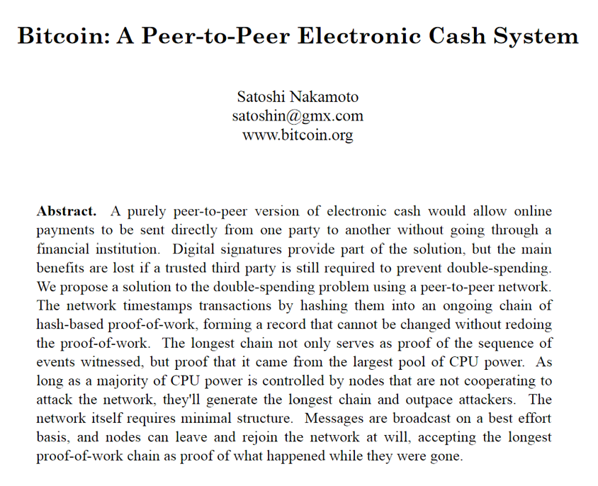
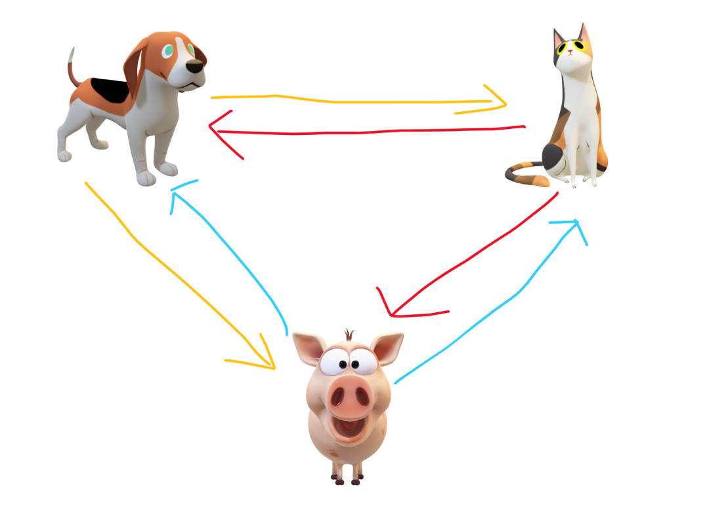

---

layout: post
title: "比特币的诞生与去中心化网络"
categories: [区块链]
tags: [区块链, 比特币]
author: busydecoding

---

本篇文章是区块链系列文章的第一篇，主要内容是比特币白皮书的诞生，以及对去中心化网络的解释。

1.

比特币的诞生

2008年11月1日，一个自称中本聪（Satoshi Nakamoto）的人在一个论坛上发布了名为《比特币：一种点对点的电子现金系统》的论文，该论文后被称为比特币白皮书。这篇论文首次提出了比特币（Bitcoin）的概念。后来中本聪开发出了最早的比特币代码原型，并在2009年1月3日发布了第一个比特币区块。这篇中本聪的原始论文依然是每一名想了解比特币原理的人的推荐入门读物，论文地址：https://bitcoin.org/bitcoin.pdf

在论文中，中本聪提到了要创造一种完全点对点的电子货币，通过这种电子货币，在线支付可以直接从一方发送到另一方，而不再需要通过一个中心化的金融机构。

2.

什么是点对点和去中心化网络？

点对点，英文为Peer-to-Peer， 简称为P2P，又称为对等式网络。在一个点对点或者说对等式网络中，组成该网络的每个结点的身份都是平等且一样的，互相之间没有什么不同。

举个例子。在一个学习游泳的兴趣小组里，共有三名成员，小狗、小猫和小猪。它们之间会互相分享自己学习游泳时做的笔记。也就是说小狗可以把自己的笔记分享给小猫和小猪，小猫和小猪也是一样可以将自己的笔记分享给另外两名成员。这时，我们就可以说它们的兴趣小组组成了一个网络，每个小组成员都是这个网络上的一个结点。而这个网络是一个点对点网络，一个对等式网络。小组里每个成员的角色都是一样的，并没有谁是这个小组的中心，因此也可以称这个小组网络是一个去中心化的网络。如下图所示：

这时，突然有个小猴要加入它们的兴趣小组里，并且大家都认为这个小猴的游泳技能最好，应该由它带领大家学习游泳。于是兴趣小组规定，以后大家的学习笔记都先交给小猴，小猴做进一步整理，没有问题之后再发给大家。这也就意味着，小狗就不能直接把笔记分享给小猫或者小猪了，它必须先把笔记交给小猴，然后让小猴再把笔记交给小猫和小猪。这时，我们就可以说它们的兴趣小组已经不是一个点对点的网络，而是一个中心化的网络了。小猴就是这个兴趣小组网络的中心结点，因为成员之间交流笔记都需要找它，通过它来进行。如果有一天小猴生病了，不出来参加活动了，那么整个兴趣小组就没有办法再运转了。

3.

我们现在的金融系统是一个中心化的网络

把上边兴趣小组的例子再引申到我们的现实生活中，看看在我们现行的金融系统中的一笔交易是怎么发生的。就拿我们给别人发200元红包这个最常见的交易举例吧。

我们现在已经习惯了互相之间使用微信和支付宝进行转账了。支付宝和微信的在支付体验上的设计相当得好，所以当我们给一个微信好友发送一个红包时，在感觉上，我们会觉得这跟我们与这个人见面，直接把200块钱现金给了对方是一样的。实际上，并不是这样。实际过程是微信将你的余额减少了200元，把对方的余额增加了200元，银行转账也是一样的道理。所以在这个过程中，是微信、支付宝、银行这些中间机构（最终是银行）来对我们的账户余额进行了操作，完成了发红包这笔交易。而如果是面对面现金支付的话，那我直接把200块钱现金给你就好了，在这个交易过程中，是没有一个中间机构的。

微信、支付宝、银行也不是只服务我们一两个人的，在同一时间，可能有数十万笔发红包的交易在通过它们进行。所以微信、支付宝、银行这些机构和我们这些收发红包的人，就构成了一个网络，一个中心化的网络，每一个机构和人都是这个网络中的一个结点。在这个网络中，微信、支付宝、银行这些机构就是我们整个交易网络中的中心结点，而我们用户则是普通结点。为什么？因为没有了微信、支付宝、银行这些结点，我们就没办法再给遥远的人发红包了，而少了我们，还会有张三和李四在通过微信发红包，所以我们用户只是普通结点，我们的存在与否不影响整个网络的正常运转；而微信、支付宝、银行这些机构是中心结点，没有了它们，整个网络就瘫痪了。

不仅在交易过程中，整个系统是中心化的。其实在货币的发行过程中，现实世界也是中心化的。在世界上绝大部分的主权国家里，铸币权都是收归中央银行所有的。比如在我国，就只有人民银行有铸币权，可以发行我们的法定货币，也就是人民币。其他任何机构和个人都不能干这个事情，干了就是违法。所以我们的整个金融体系都是离不开以银行为代表的这些金融机构的。

4.

比特币是一个去中心化网络

在比特币网络中，实际上每个结点或者说成员都可以扮演银行的角色，而同时又可以互相之间进行发红包这种交易。所以并没有一个中间结点，每个结点都是一样的，少了谁，这个网络都可以继续运行下去。而且在这个网络中，每个结点的加入和离开都是自由的。只要你下载了比特币的应用软件并运行，也就等于加入了这个网络。停止运行，你也就离开了网络。

为方便理解，你可以把比特币网络想象成是一堆人聚集在一个房间里，他们都有一些比特币，他们可以随意在这个房间里走动，然后把自己手里的比特币发给别人。当然这个举例并不符合比特币的实际运行情况，但是为了便于入门理解，我们可以先这么认为，等到后续内容慢慢展开，我们了解地越来越多的时候，我们会越来越接近实际。

比特币不仅在交易过程中是去中心化的，在产生和发行环节也是去中心化的。理论上比特币网络中的每个结点都可以自己生产出来比特币（俗称挖矿），所以他们就更不需要银行这样的中间机构了。

5.

中心化网络和去中心化网络并没有高下之分

很多人在初识比特币、区块链技术的时候，会觉得去中心化网络太好了，可以解决很多中心化网络存在的问题。但同时我们必须认识到，真实的世界是非常复杂的，去中心化并不是什么问题都能解决的灵丹妙药，中心化网络肯定也不是一无是处。现在中心化的金融体系虽然也存在着一些问题，但也并不是说简单地换成去中心化的模式就能万事大吉了。而且去中心化网络只是一个理念，想要在具体的某个场景中落地，还面临着方方面面的问题。

6.

比特币≠区块链

我们应当知道，比特币并不等同于区块链，只不过比特币是第一个区块链技术的应用而已。区块链技术实际上是在一个去中心化的网络中通过密码学等技术手段解决了信任问题，也因此区块链技术能做到的事情远不止加密货币。

下一篇文章，我们来看看比特币、区块、区块链到底都长什么样子。
