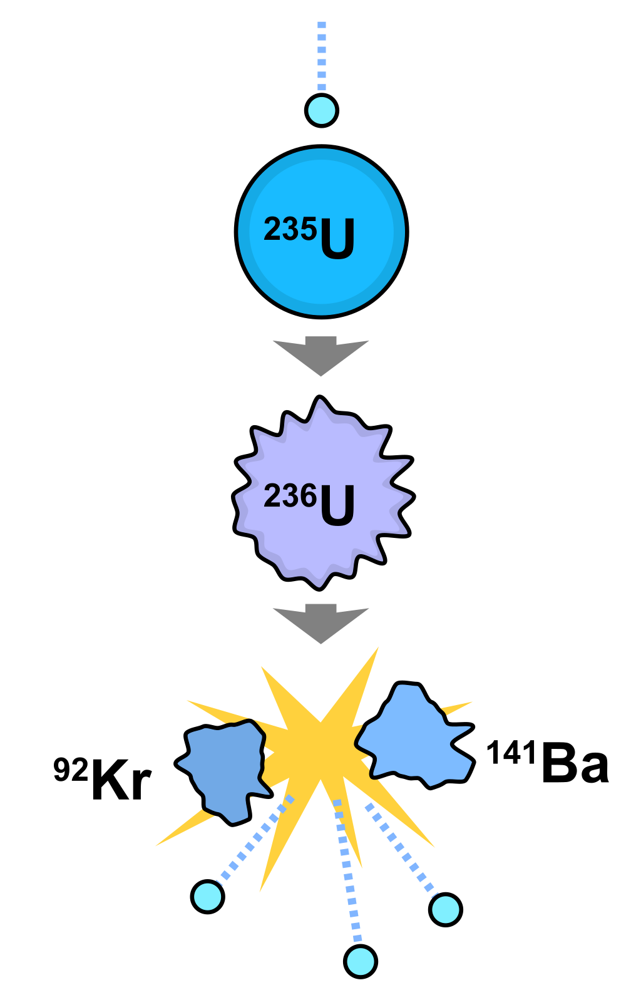
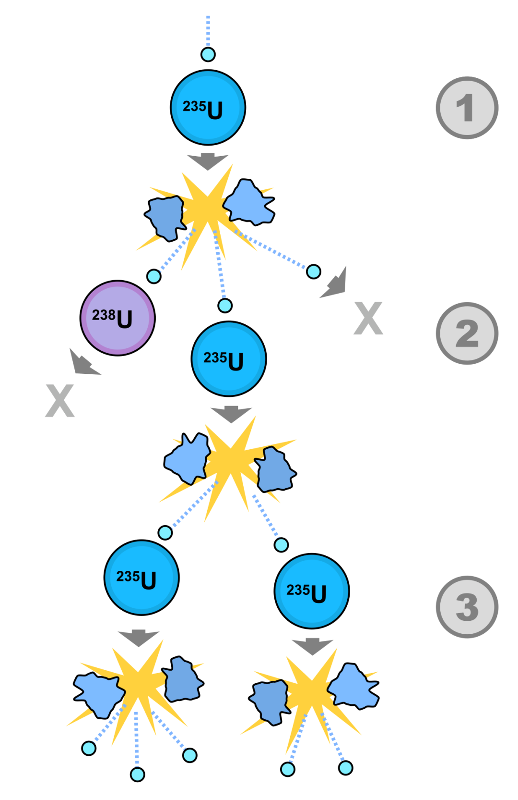

---

layout: post
title: "等待《奥本海默》上映之前，我补了一下核裂变原理"
categories: [思考]
tags: [思考]
author: busydecoding

---

电影《奥本海默》海报，图片来自于豆瓣

在等待《奥本海默》上映之前，我补了一下核裂变原理，我目前理解的过程是这样的：

用中子去轰击铀235、钚239等质量比较大的原子核，会导致他们分裂为两个较轻的原子核（比如铀235会分裂为钡和氪），以及多个中子，同时释放出大量能量。

图片来自于维基百科

裂变释放出的中子又会轰击到其他重核，导致其他重核的分裂，形成自发的链式反应。可见核裂变的链式反应是一个不断加速的过程。

图片来自于维基百科

而原子弹就是因为核裂变的链式反应，所以可以在极短时间内释放出巨大的能量。

核电站可以通过中子吸收材料（磞、银、铅等）来吸收反应堆中核裂变释放的中子，以使链式反应的速率可以得到人为的控制，让核能得以稳定地释放。

核能以热能的形式加热冷却剂形成高温高压蒸汽，带动涡轮机、发电机运转。

但我还没搞清楚核裂变释放出的能量到底来自于哪里，值得注意的是两点：

1. 裂变后两个质量较轻的原子核的质量之和小于裂变前重核的质量，也就是说裂变后发生了质量亏损
2. 裂变后两个质量较轻的原子核中的结合能之和小于裂变前重核的结合能

根据能量守恒定律，可能裂变释放的能量来自于2中结合能的差值，同时根据爱因斯坦质能方程E=mc^2，质量和能量是可以相互转换的，所以1可能是2中结合能之差再减去裂变释放出的能量后得到的。

但是也可能2中结合能有差值是因为1中的质量亏损，因为根据质能方程也能推导出质量小了所以导致能量小了，能量差值部分就是裂变释放出的能量。

搞不清楚，我问AI核裂变释放的能量来自于哪里，它说是1和2两者都有。

如果有懂的朋友欢迎来解答我心中的疑惑。不过这个疑惑应该不影响观影。
