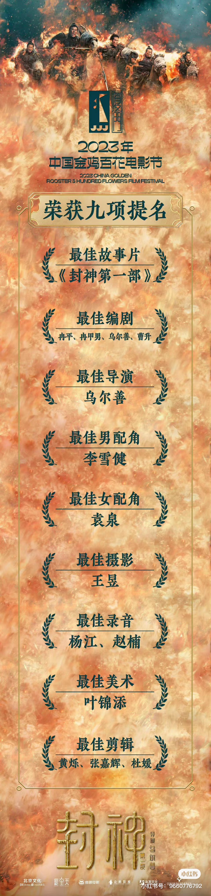
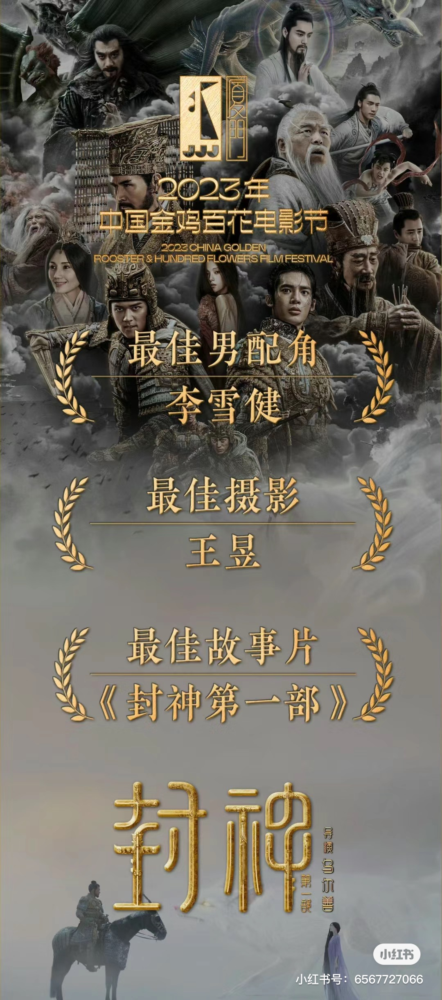

---

layout: post
title: "聊聊我为什么这么喜欢《封神第一部》"
categories: [思考]
tags: [电影]
author: busydecoding
  
---

昨天的金鸡奖，《封神》剧组斩获了九项提名，并最终拿到了其中的三个奖项。

封神自来水表示为他们感到高兴。自7月底看过这部电影之后，我和我伴侣就成了这部电影的自来水。我们甚至去电影院又看了一次IMAX版本（迄今为止，唯一一次在电影院二刷电影）。但回顾当时二刷的原因，其实也并不是在看了电影本身之后就决定要再看一次的。当时看完电影之后，只是觉得挺不错的，远超预期。但真正让我们决定要二刷的，是因为随后在B站上看到了《封神第一部》幕后的纪录片。

在纪录片中，我们看到了诸多观影过程中被我们忽略的细节，诸如布景、道具、音乐等等，剧组都倾注了大量心血。比如，没有用特效，而是真的去打造了龙德殿这个核心场景，并为此请了很多的木工匠人。比如，比干的心和婴儿雷震子竟然都是手工制作的道具，由机械和电子驱动，可以人为控制。我们完全被惊住了。

而在这些“物”之外，更打动我的，是“人”。

一方面是了解到参与制作电影的，前前后后足足有数千人，花了几年的时间。他们各司其职，互相配合，才能最终将这部电影呈现给我们观众。

另一方面，是导演和主演们的精神风貌打动了我。

先说说导演乌尔善。业务能力上当然没得说，在《封神三部曲》之前，他已经有像《画皮II》和《鬼吹灯之寻龙诀》这样的大片证明他的能力了。《封神三部曲》更是再一次证明了他操刀大制作电影的能力。但其实更触动我的，是他在业务之外的样子，我看过不少他在路演、采访、综艺中的表现。首先，他是很勤奋的，愿意到处跑，去宣传这部电影。然后，他谈话是很真诚的，会很配合地、很认真地回答问题。他也会接受网友对于宣传等方面的建议，真的去改。

最后，他会给我一种“精神内核极其稳定”的感觉。我们都知道拍这样的大制作很难，跑宣传很累，电影刚开始的票房也很不理想等等这些现实中的困难，但你总是会看到情绪稳定的乌尔善在认真地做事，并时不时发出标志性的哈哈笑声。在芒果TV播出的《封神训练营》综艺中，一个演员因为档期的原因，没有能和导演乌尔善以及其他的演员一同参加节目的录制，而是在另一个时间段单独来参加的录制。但乌尔善选择和他一起又录了一遍。

在导演之外，主演们的精神风貌也是深深打动了我。

不论是男演员还是女演员，这些新人演员，他们都给了我一种“澎湃的生命力”的感觉。我相信内地的影视剧观众都能明白我的意思。他们的活力、强健的体魄和向上的精神面貌，都让人耳目一新。尤其是在最近两年很多男明星出事的背景下，我们更需要这些新鲜血液的到来，让整个体系更有生机一些。而且通过看纪录片等资料，你会了解到演员们参加了半年多《封神》剧组的特殊训练之后转变的整个过程。这个成长的过程，是关于勤奋、关于刻苦、关于坚持、关于认真的，这个也很打动我（也激励我跑步、练肌肉）。

期待明年夏天的《封神第二部》，也期待更强壮、更好的自己，期待未来有更多的讲好中国文化的电影。
